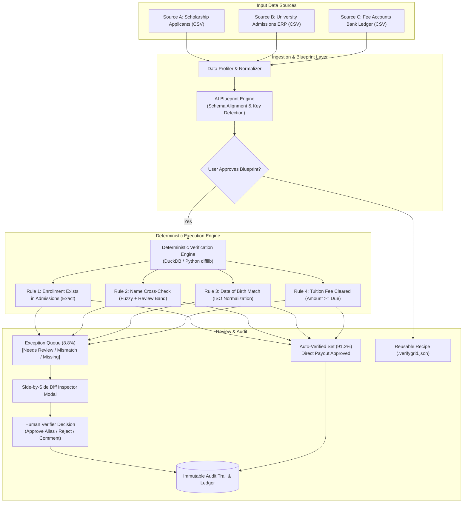
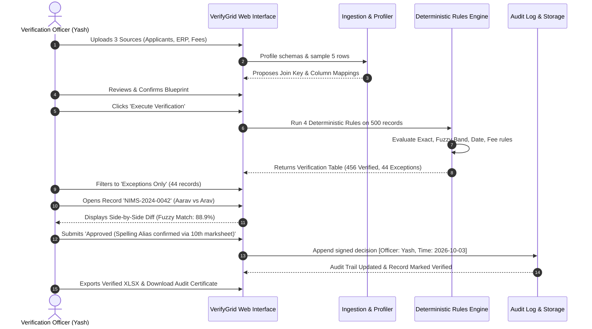

# VerifyGrid System Architecture & Specification

## 1. System Overview

**VerifyGrid** is a deterministic multi-source reconciliation and verification platform tailored for non-technical institutional teams (admissions, scholarship cells, registrar exam branches, accounts audit).

Unlike generic diff utilities or complex enterprise data warehousing pipelines, VerifyGrid solves the entire **manual verification lifecycle**:
1. Multi-source file ingestion (CSV, XLSX, PDF tables).
2. AI-assisted verification blueprint (schema inference, key discovery).
3. Plain-English rules compiled into deterministic execution logic.
4. Exception-only human-in-the-loop review queue.
5. Cryptographically timestamped audit trail and downloadable sign-off certificate.

---

## 2. Core Architectural Philosophy

> **"Machines do the matching. Humans only judge the exceptions. Every decision leaves a trail."**

```
 ┌────────────────┐       ┌────────────────┐       ┌────────────────┐
 │    Source A    │       │    Source B    │       │    Source C    │
 │ (Applicants)   │       │ (Registrar ERP)│       │(Accounts Ledger│
 └───────┬────────┘       └───────┬────────┘       └───────┬────────┘
         │                        │                        │
         ▼                        ▼                        ▼
 ┌──────────────────────────────────────────────────────────────────┐
 │                    1. Ingestion & Profiling                      │
 │     - Header Sanitization     - Date Normalization               │
 │     - Key Candidate Discovery - PII Masking                      │
 └────────────────────────────────┬─────────────────────────────────┘
                                  │
                                  ▼
 ┌──────────────────────────────────────────────────────────────────┐
 │             2. AI Verification Blueprint (LLM Layer)             │
 │     - Cross-source Column Alignment                              │
 │     - Key Join Strategy (Normalized Alphanumeric Roll No)        │
 │     - Rule Template Drafting (Plain English -> JSON Rules)       │
 └────────────────────────────────┬─────────────────────────────────┘
                                  │
                                  ▼
 ┌──────────────────────────────────────────────────────────────────┐
 │             3. Deterministic Rules Engine (DuckDB / SQL)         │
 │   * Strictly Non-Hallucinatory / Zero LLM in Pass-Fail Eval *    │
 │     - Exact Existence Checks (Source B Lookup)                   │
 │     - Transliteration / Levenshtein Name Match (Review Band)     │
 │     - ISO Date Normalization & Equality                          │
 │     - Fee Clearance & Amount Threshold                           │
 └────────────────────────────────┬─────────────────────────────────┘
                                  │
                                  ▼
 ┌──────────────────────────────────────────────────────────────────┐
 │               4. Verification Grid & Exception Queue             │
 │     - 90%+ Records Auto-Verified                                 │
 │     - Flagged Exceptions: [NEEDS_REVIEW | MISMATCH | MISSING]    │
 │     - Side-by-Side Multi-Source Source Diff Inspector            │
 └────────────────────────────────┬─────────────────────────────────┘
                                  │
                                  ▼
 ┌──────────────────────────────────────────────────────────────────┐
 │            5. Human-in-the-Loop Sign-Off & Audit Trail           │
 │     - Verifier Override with Justification & Staff Role          │
 │     - Immutable Audit Ledger (Timestamped Decision Records)      │
 │     - Export: Verified XLSX, Audit PDF, Reusable JSON Recipe     │
 └──────────────────────────────────────────────────────────────────┘
```

---

## 3. High-Level Data Flow Diagram (Mermaid)



---

## 4. Sequence Diagram (Verification Run & Human Exception Sign-Off)



---

## 5. Rule Schema Specification

All plain-English rules compile into a deterministic JSON specification:

```json
{
  "rule_id": "R2_NAME_MATCH",
  "name": "Applicant Name Cross-Check with Transliteration Tolerance",
  "type": "fuzzy_string_similarity",
  "left": {
    "source": "Source_A_Applicants",
    "column": "candidate_name"
  },
  "right": {
    "source": "Source_B_Admissions",
    "column": "student_full_name"
  },
  "normalizers": [
    "strip_titles",
    "lowercase",
    "collapse_spaces",
    "remove_special_chars"
  ],
  "thresholds": {
    "auto_pass_min": 0.92,
    "review_band_min": 0.75
  },
  "actions": {
    "on_pass": "VERIFIED",
    "on_review_band": "NEEDS_REVIEW",
    "on_fail": "MISMATCH"
  }
}
```

---

## 6. Privacy & DPDP Act 2023 Compliance Guardrails

1. **No External LLM Leakage:** Full student datasets are never passed to external AI APIs. Only column headers and masked sample tokens are sent for schema mapping.
2. **Deterministic Evaluation:** Pass/Fail decisions are computed locally via deterministic code (DuckDB / Python / Browser client), ensuring zero hallucination.
3. **PII Masking:** Bank account numbers, contact details, and sensitive attributes are masked (`****-****-4921`).
4. **Append-Only Audit Trail:** Decisions cannot be silently edited or deleted, preserving accountability for government and CAG audit compliance.
